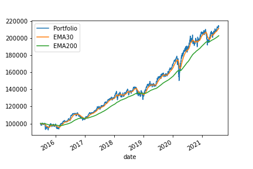

# azapy project
## Financial Portfolio Optimization Algorithms
### An open-source python library for everybody

Author: Mircea Marinescu

email: Mircea.Marinescu@outlook.com

[Package documentation](https://azapy.readthedocs.io/en/latest)

Package installation: `pip install azapy`

### Contents
A. Risk-based portfolio optimization algorithms:
  1. mCVaR - mixture CVaR (Conditional Value at Risk)
  2. mSMCR - mixture SMCR (Second Moment Coherent Risk)
  3. mMAD - m-level MAD (Mean Absolute Deviation)
  4. mLSD - m-level LSD (Lower Semi-Deviation)
  5. mBTAD - mixture BTAD (Below Threshold Absolute Deviation)
  6. mBTSD - mixture BTSD (Below Threshold Semi-Deviation)
  7. GINI - Gini index (as in Corrado Gini statistician 1884-1965)
  8. SD - standard deviation
  9. MV - variance (as in mean-variance model)
  10. mEVaR - mixture EVaR (Entropic Value at Risk)
  (alpha version)

For each risk-based class the following optimization strategies are
available:
  1. Optimal-risk portfolio for targeted expected rate of return value
  2. Sharpe-optimal portfolio - maximization of generalized Sharpe ratio
  3. Sharpe-optimal portfolio - minimization of inverse generalized Sharpe
  ratio
  4. Minimum risk portfolio
  5. Optimal-risk portfolio for a fixed risk-aversion factor
  6. Optimal-risk portfolio with the same risk value as a benchmark portfolio
  (e.g., same as equal weighted portfolio)
  7. Optimal-diversified portfolio for targeted expected rate of return
  (minimization of inverse *1-D* ratio) (beta version)
  8. Optimal-diversified portfolio for targeted expected rate of return
  (maximization of *1-D* ratio) (beta version)
  9. Maximum diversified portfolio (beta version)
  10. Optimal-diversified portfolio with the same diversification factor as
  a benchmark portfolio (e.g., same as equal weighted portfolio)
  (beta version)
  11. Optimal-diversified portfolio with the same expected rate of return as
  a benchmark portfolio (e.g., same as equal weighted portfolio)
  (beta version)

B. "Naïve" portfolio strategies:
  1. Constant weighted portfolio. A particular case is equal
     weighted portfolio.
  2. Inverse volatility portfolio (i.e., portfolio weights are proportional to
     the inverse of asset volatilities)
  3. Inverse variance portfolio (i.e., portfolio weights are proportional to
     the inverse of asset variances)
  4. Inverse drawdown portfolio (i.e., portfolio weights are proportional to
     the asset absolute value of maximum drawdowns over a predefined
     historical period)

C. Greedy portfolio optimization strategies:
  1. Kelly's portfolio (as in John Larry Kelly Jr. scientist 1923-1965) -
     maximization of portfolio log returns

Utility functions:
  * Collect historical market data from various providers.
    Supported providers:

    - yahoo.com
    - eodhistoricaldata.com
    - alphavantage.co
    - marketstack.com

  * Generate business calendars. At this point only NYSE business calendar
    is implemented.
  * Generate rebalancing portfolio schedules.
  * Append a cash-like security to an existing market data object.
  * Update market data saved in a directory.
