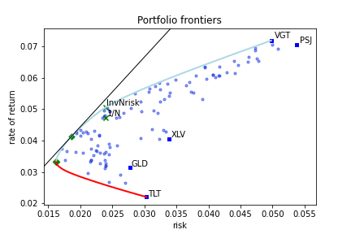

# Introduction

A *Risk-based optimal portfolio* is the
portfolio that, in some sense, has the best combination between the expected
returns and the dispersion of possible outcomes.

Given a portfolio, we can
estimate ex-ante is its expectation of returns.
The actual realization of
an investment in this portfolio could be larger or smaller than this
expectation. Therefore, the dispersion of possible
outcomes around the expectation of returns is a quantity of interest
for investors.
A smaller dispersion suggests that the actual
return may be closer to its computed expected value.

The dispersion of possible outcomes is often called
*risk*.
The quantity that measures the dispersion of possible outcomes is called
dispersion
or risk measure. In this document we will use both terms
interchangeable.

The dispersion measure can be defined in many ways. **azapy** package
provides a comprehensive collection of risk-based portfolio optimization
strategies based on the following dispersion measures:

* **mCVaR** - mixture Conditional Value at Risk,
* **mSMCR** - mixture Second Moment Coherent Risk,
* **mMAD** - m-level Mean Absolute Deviation,
* **mLSSD** - m-level Lower Standard Semi-Deviation,
* **mBTAD** - mixture Below Threshold Absolute Deviation,
* **mBTSD** - mixture Below Threshold Standard Deviation,
* **GINI** - Gini index,
* **MV** - Variance (as in mean variance model),
* **SD** - Standard Deviation.

In each case several optimization strategies are implemented. To
understand them better, let's look at a generic example of portfolio frontiers
graphically represented in the figure below.

_Fig 1. : Example of portfolio frontiers - risk vs. expected rate of return._

This is a typical representation of portfolio frontiers. On the x-axis we
have the values of the dispersion measure (risk) while on the y-axis
is the expected rate of returns. Several features are worth mentioning.

The blue line is called the *efficient frontier*. It represents
the set of portfolios with the highest expected rate of returns for a
given value of risk. These are the portfolios of interest for an investor.

The lower
red line is called the *inefficient frontier*. These are the portfolios
with the lowest rate of returns for a given value of risk. Clearly, this
family of portfolios are to be avoided by an investor.

The leftmost point, where the blue and red lines meet, is the
*Minimum Risk Portfolio* (also called *Global Minimum Risk Portfolio*).
This is the portfolio with minimum risk. Investing
in minimum risk portfolio is a relative common strategy among
professional investors.

The black straight line, in the upper part of the plot, is tangent to the
*efficient frontier*. Its intersection with the y-axis (not shown in the plot)
is at a level equal with the risk-free rate accessible to the investor.
In this example the risk-free rate was set to 0. The
tangency point along the efficient frontier (in our plot depicted by a green
diamond) is the
*tangency portfolio* or the *market portfolio*. This is the portfolio
that maximizes the $\rho$-Sharpe ratio.
The $\rho$-Sharpe ratio[^sharpe] is defined as

\begin{equation*}
  \gamma = \frac{R - r_f}{\rho},
\end{equation*}

where:

* $R$ is the portfolio expected rate of return,
* $r_f$ is the risk-free rate accessible to the investor,
* $\rho$ is the dispersion of portfolio rate of return.

Therefore, the portfolio that maximizes the $\rho$-Sharpe ratio is the portfolio
with the highest expected excess rate of return (above the risk-free rate)
per unit of risk, $\rho$.
This is a remarkable efficient portfolio often preferred by
the investors.

All the points between the efficient (blue line) and
inefficient (red line) frontiers are called *inefficient portfolios*.  
There are no valid portfolios outside the portfolio frontiers.

The solid blue squares are the portfolios where the
entire capital is allocated to a single component. They are labeled by
the market symbol of this portfolio component.

Among the *inefficient portfolios* there is a remarkable portfolio. That is
the portfolio with equal weights. All weights
are equal to $1/N$ where $N$ is the number of portfolio
components. Hence, its name $1/N$*-portfolio* or *inverse-N portfolio*.
In our plot this portfolio is represented by a green X with label $1/N$.

On the *efficient frontier* there is its correspondent. In our plot
it is a green X with label *InvNrisk*. This is the efficient portfolio
that has the same risk as the equal weighted portfolio.
In-sample both portfolios have the same risk while
the expected rate of returns is larger for *InvNrisk*  than
for *inverse-N* portfolio. However, out-of-sample, especially for short
period of observations, equal weighted may outperform *InvNrisk* portfolio.

Another way to visualize the portfolio frontiers is presented in the following
figure.

_Fig 2. : Example of portfolio frontiers - expected rate of return vs. Sharpe ratio._

It contain the same information as Fig 1. However, now the
x-axis is the expected rate of return while the y-axis is the
$\rho$-Sharpe ratio.
We have preserved the color code and all the symbols from Fig.1.

Fig 2. gives a better understanding of portfolio efficiency in terms of
expected excess return per unit or risk.

For all dispersion measures mentioned above, the **azapy** package offers
the following portfolio optimization strategies:

1. **_Minimization of risk for targeted expected rate of return._** This is
the most common portfolio optimization strategy. It returns portfolios
along the efficient frontier (blue line in Fig 1 and 2).
The strategy requires the user to
input the desired value of the expected rate of return. This value must be
between the expected rate of return of the efficient portfolio with minimum
risk and the highest rate of return among the portfolio components. If
the input value is outside of this range than it will automatically default
to the nearby limit. In the code this strategy is designated by setting
`rtype='Risk'`.
2. **_Maximization of $\rho$-Sharpe ratio._** This is the portfolio with the highest
expected excess rate of return per unit of risk hold by the investor. It is a
very popular strategy among investors.
In the code this strategy is designated by setting `rtype='Sharpe'`.
3. **_Minimization of inverse $\rho$-Sharpe ratio._** Obviously, this strategy is
logically equivalent with the one above. It returns the same portfolio
weights. However, from a mathematical point of view, the direct
minimization of inverse Sharpe ratio is a different programming problem
than the direct maximization of Sharpe ratio.
Both methods have proved to be very stable with similar
computational times. For completeness, we choose
to make available this implementation under the setting `rtype='Sharpe2'`.
4. **_Minimum risk portfolio._** This is the efficient portfolio with
minimum risk (the most left limit of the *efficient frontier*). It is
a common strategy among professional investor. It is available
under the setting `rtype='MinRisk'`.
5. **_Maximization of expected rate of return for targeted risk value._**
The strategy returns portfolios along the efficient frontier (blue line
in Fig. 1 and 2). Requires the user to enter the desired value of risk.
In general it is not intuitive for an investor to specify outright a rational
value for risk. However, this strategy is useful if we want to
find an efficient portfolio that has the same risk as  benchmark
portfolio. The most common example is the efficient portfolio
with the same risk as the equal weights portfolio. In the code this
strategy is designated by setting `rtype='InvNrisk'`. Our
implementation allowed to enter any benchmark portfolio by specifying
its weights.
6. **_Maximization of the expected rate of return for a fix risk-aversion factor._**
In this strategy the optimal portfolio weights
maximize the quantity $R -\lambda \rho$, where $R$ is the portfolio
expected rate of returns, $\rho$ is the risk, and $\lambda$ is
the *risk-aversion* factor. $\lambda$ takes values between $0$ and
$+\infty$. For $\lambda=0$ the optimal portfolio will contain only the
asset with higher expected rate of return. This is the rightmost
point along the *efficient frontier*. For $\lambda=+\infty$ the optimal
portfolio is the *minimum risk portfolio*, the leftmost point on
the *efficient frontier*. Any other values for $\lambda$ will lead to an
optimal portfolio along the *efficient frontier*. In general it is
not intuitive for an investor to specify a rational value
for the *risk-aversion* factor. The same value of $\lambda$ may lead
to different portfolio compositions under different dispersion
measures and market conditions. Therefore, a direct engagement of  
this strategy, by specifying a desired value for $\lambda$, may not
be convenient. However, this strategy may be useful if it is combined
with a strategy to estimate the value of *risk-aversion* factor based on
market conditions (*e.g.* technical analysis, etc.).
In the code this optimization strategy is designated by setting
`rtype='RiskAverse'`.

**azapy** package covers, 9 risk-based dispersion measures $\times$ 6
optimization strategies,
in total 54 risk-based portfolio optimization strategies.[^strat]

The natural question that arises is: which one is the best?

There is no absolute answer to this question and so there is no
substitute to our personal research. To this end, **azapy** package
provides the necessary
analytical tools to perform a quiet comprehensive quantitative portfolio
analysis.

_Fig 3. Example of out-of-sample (back testing) portfolio performance._

An out-of-sample analysis, also called backtesting or historical simulation,
can be performed for any of the implemented portfolio
strategies. The following information can be extracted:
1. Portfolio realized rate of return. It is available monthly, annually
and by rolling period. From these reports one can easily gauge the magnitude and
seasonality of returns.
2. The realized drawdown events. It is a very important information that can
give a measure for the amount and duration of losses that an investor is
exposed to.
3. Easy graphical and numerical comparisons between different strategies or
different portfolios all together.

Examples of how to carry out a portfolio out-of-sample analysis are present
in a collection of
[Jupyter notebooks](https://github.com/Mircea-MMXXI/azapy/tree/main/jpy_scripts)
and [Python scripts](https://github.com/Mircea-MMXXI/azapy/tree/main/scripts/portfolios).
They can be used as a source of inspiration for further research.

Once we have decided for a portfolio composition and optimization strategy,
**azapy** can help with portfolio maintenance. It can proved comprehensive
information regarding the prevailing portfolio weights, number of shares,
delta positions and cash flow at rebalancing time.
An example is provided in a
[Jupyter notebook](https://github.com/Mircea-MMXXI/azapy/blob/main/jpy_scripts/Rebalance_example.ipynb).

**azapy** package has its own facility to collect historical market data from
various providers[^apikey]
(see section [*Read historical market data*](./Util_readMkT.html#HistMkTData)).

[^sharpe]: The concept of Sharpe ratio was introduced in
1966 by William F. Sharpe.
In the original definition $\rho$ is the portfolio volatility $\sigma$
(standard deviation).
In our presentation we use a generalization of Sharpe ratio where the
volatility is replaced by the prevailing dispersion
measure, $\rho$. We call it $\rho$-Sharpe.

[^strat]: Not all strategies are independent. For example `'Sharpe'` and
`'Sharpe2'` produce identical result (up to numerical precision) although
they have different numerical implementations. Also there are overlaps between
`MV` and `SD` based strategies, *etc.*.

[^apikey]: Some of the market data providers require a valid API key.
